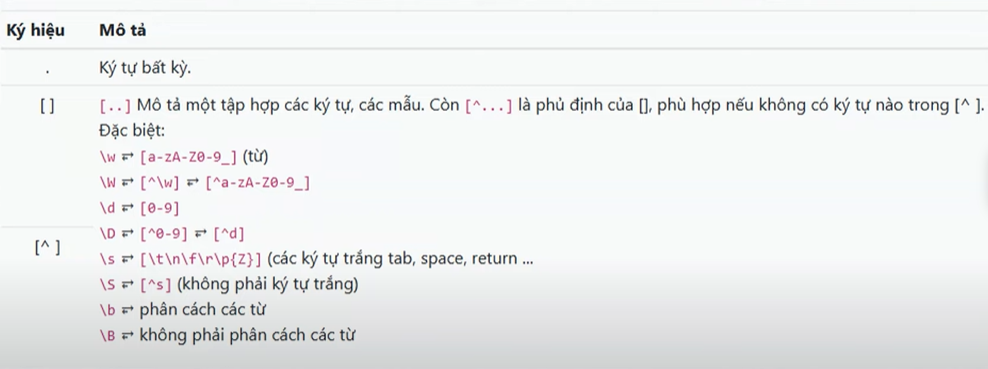
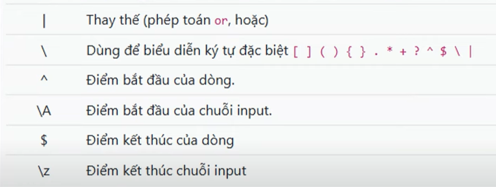
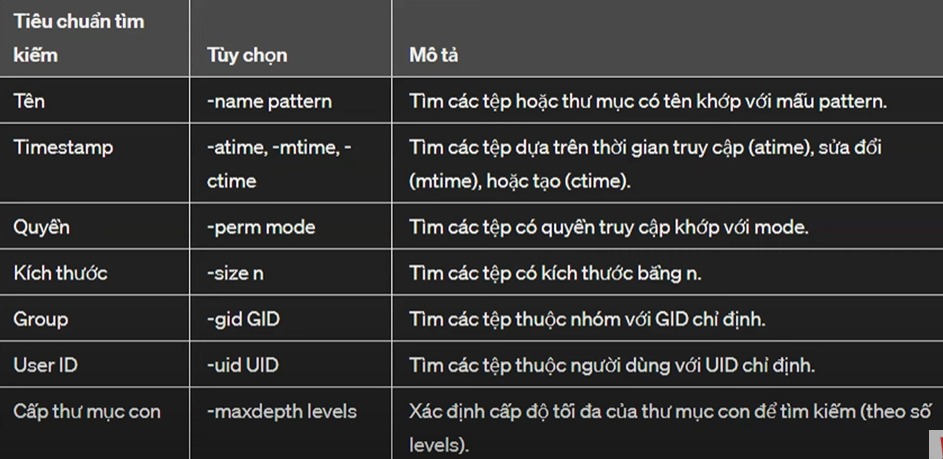
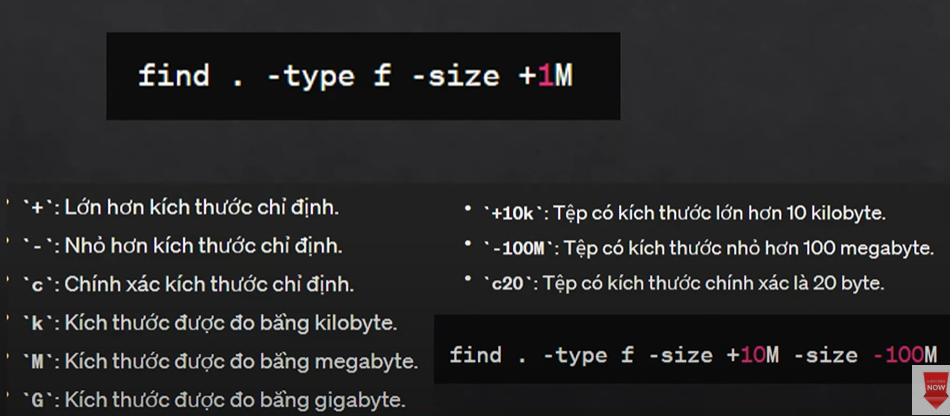
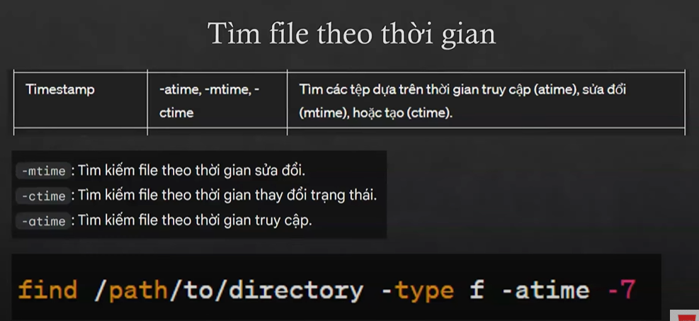
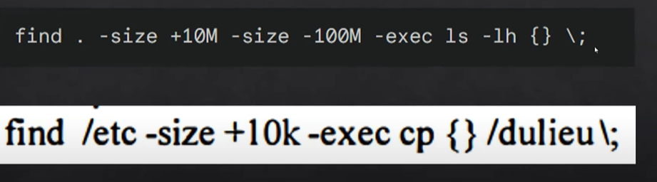
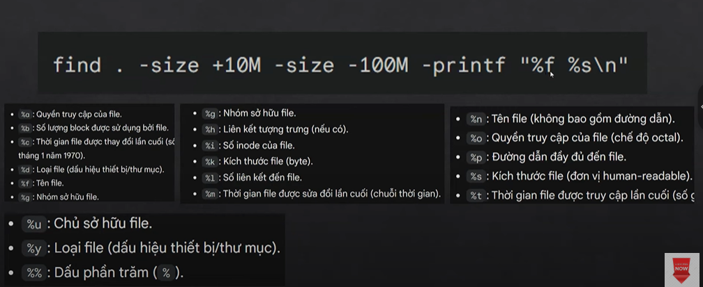

##### ls 
- -l	Hiển thị thông tin chi tiết về các tệp tin và thư mục (quyền, kích thước, ngày sửa đổi, chủ sở hữu, v.v.).
- -a	Hiển thị tất cả các tệp tin và thư mục, bao gồm cả các tệp ẩn (các tệp bắt đầu bằng dấu chấm ".").
- -h	Hiển thị kích thước của các tệp tin và thư mục theo đơn vị dễ đọc (ví dụ: KB, MB, GB).
- -t	Sắp xếp kết quả theo thời gian sửa đổi, từ mới nhất đến cũ nhất.
- -r	Sắp xếp kết quả theo thứ tự ngược lại (ví dụ: nếu bạn dùng -t, nó sẽ sắp xếp từ cũ nhất đến mới nhất).
- -R	Hiển thị cả các thư mục con và nội dung bên trong chúng (liệt kê đệ quy).
- --color	Tô màu cho kết quả hiển thị (các loại tệp khác nhau có màu khác nhau).
- -S	Sắp xếp kết quả theo kích thước, từ lớn nhất đến nhỏ nhất.
- -G	Hiển thị kết quả dưới dạng ngắn gọn, không hiển thị tên người sở hữu (group).
- -i	Hiển thị số inode của mỗi tệp tin hoặc thư mục.
- --group-directories-first	Nhóm tất cả các thư mục đầu tiên trong danh sách, sau đó hiển thị các tệp tin.
  ##### mkdir 
  - mkdir [options] directory
  - options: -p cho phép tạo thư mục ngay cả o có thư mục cha
##### tree
##### du
- du: Hiển thị dung lượng đĩa được sử dụng bởi tất cả các tệp và thư mục trong thư mục hiện tại.
- du -h: Hiển thị dung lượng đĩa được sử dụng ở dạng dễ đọc (KB, MB, GB).
- du -s: Hiển thị tổng dung lượng của thư mục được chỉ định mà không hiển thị chi tiết của từng tệp.
- du -a: Hiển thị dung lượng của tất cả các tệp và thư mục, bao gồm cả các tệp ẩn.
- du -c: Hiển thị tổng dung lượng của tất cả các thư mục và tệp, cùng với tổng cộng ở cuối.
##### rmdir
- rmdir [options] dir
- -p xóa cả cha con
##### echo
- echo "nội dung" ==>>== dir/têp.txt(.doc) : không ghi đè
-                 ==>==                  : ghi đè   
##### touch 
- touch data/tep.txt : tập tin rỗng
##### cat 
- cat dir/tep.txt
##### cp
- cp [options] dir
 ##### mv
- mv []dir -i -f
##### rm

##### ký tự ? và *
- ? đại diện cho ==1== ký tự
- * đại diện cho ==nhiều== ký tự kể cả khoảng trống
### các lệch xem nội dung
- cat [tên_tệp]: Hiển thị toàn bộ nội dung của tệp tin trên màn hình.
- more [tên_tệp]: Hiển thị nội dung của tệp tin từng trang một. Nhấn Space để di chuyển xuống một trang, Enter để di chuyển xuống một dòng, và 'q' để thoát khỏi chế độ xem.
- less [tên_tệp]: Hiển thị nội dung của tệp tin một cách tương tác và có thể lùi trang. Sử dụng các phím mũi tên để di chuyển lên/xuống, Space để di chuyển một trang, và 'q' để thoát khỏi chế độ xem.
- tail [tên_tệp]: Hiển thị các dòng cuối cùng của tệp tin.
- tail -n [số_dòng] [tên_tệp]: Hiển thị số lượng dòng cuối cùng được chỉ định.
- head [tên_tệp]: Hiển thị các dòng đầu tiên của tệp tin.
- head -n [số_dòng] [tên_tệp]: Hiển thị số lượng dòng đầu tiên được chỉ định.
##### "|" đường ống
- outputoutput của câu lệch trước là inputinput câu lệnh sau.
### grep
- grep [options] "pattern" [file]
- options: 
- -c: đếm sô lần xh của string
- -i: bỏ qua phân biệt hoa thường
- -v: lọc kq o khớp
- -n: hiển thị số dòng tìm kiếm trong file
  ### biểu thức chính quy
- 
- 
- 
### find
##### tìm theo vị trí 
- find [vi tri][tiêu chuẩn tìm]
- 
- vd: find ./doc -maxdepth 5 -name "baitap"
##### tìm theo kích cỡ
- find [] -type f -size +1M
- 
##### tìm theo tg
- find [] -type f -atime -1
- 
### -exec
  - 
### -frintf
  - 